

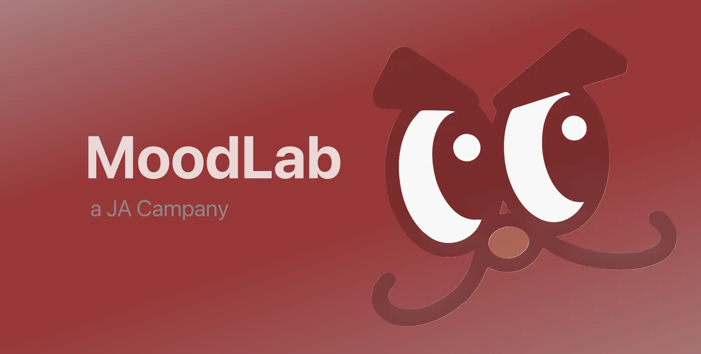

# MoodLab

**專屬香港家庭的 情緒共享空間** 
**A specialised relaxation space for Hong Kong families.**

_MoodLab is a JA Company by the students of CASCCMC · HSBC x JA Company Programme 2025/26_

 

 

---

## 📖 關於我們 · About Us

MoodLab 以桌遊為載體，搭建青少年與不同年代群體的交流橋樑，讓家長與子女在遊戲過程中相互理解、消除誤會，打造一個包容和諧的跨代共融生態。

MoodLab uses board games and playful hardware to build bridges between youth and different generations — helping parents and children understand each other, resolve misunderstandings, and create an inclusive, harmonious multi-generational ecosystem.

### 🎯 使命・願景・核心價值 · Mission / Vision / Values

|             | 中文                                 | English                                                                      |
| ----------- | ------------------------------------ | ---------------------------------------------------------------------------- |
| **Mission** | 消除誤會，共築包容和諧的跨代共融生態 | Eliminate misunderstandings & build an inclusive intergenerational ecosystem |
| **Vision**  | 透過遊戲交流過程相互理解、尊重與體諒 | Mutual understanding, respect & empathy through shared play                  |
| **Values**  | 理解 · 尊重 · 體諒                   | Understand · Respect · Empathise                                             |

---

## 🏆 獎項 · Awards

  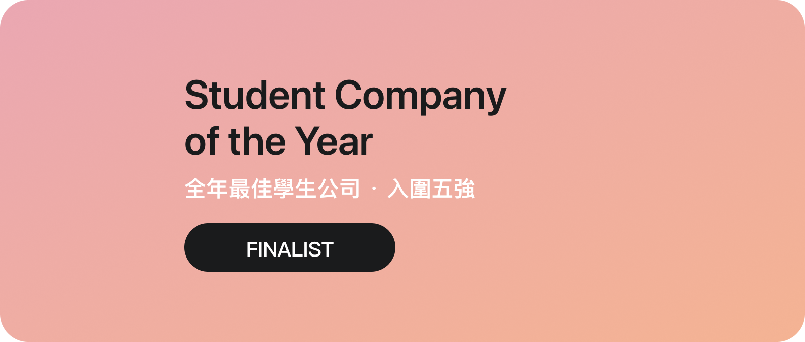
  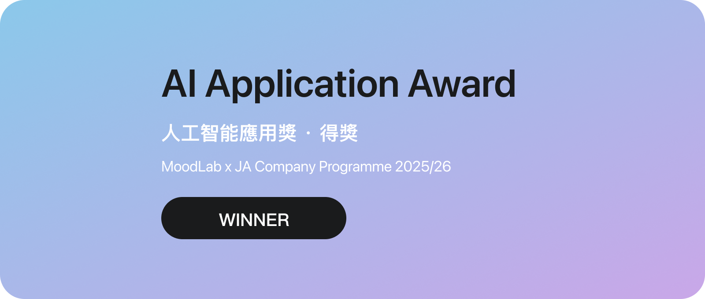

於 **2026-03-07/08 啟德 K11 市集**中，MoodLab 由 **84 間參賽學生公司**中脫穎而出，奪得兩項榮譽。其中 AI Application Award 特別表彰 MoodLab AI —— 由團隊自研、內嵌於網站的智能客服助手，以及背後由 [@ChuTM](https://github.com/ChuTM) 一手開發的完整數碼生態。

At the Kai Tak K11 pop-up market on 7-8 March 2026, MoodLab stood out among **84 student companies** to win two honours. The AI Application Award recognises MoodLab AI — our in-house intelligent assistant — and the full digital ecosystem behind it, built single-handedly by [@ChuTM](https://github.com/ChuTM).

---

## 📊 數字一覽 · By the Numbers

| 參賽公司 **84** companies competed | 奪得獎項 **2** awards won | 自研系統 **7** systems built | 手寫程式碼 **17,508** lines of code | 核心成員 **23** team members | 產品線 **3** product lines |
| :--------------------------------------------------------------: | :-----------------------------------------------------: | :--------------------------------------------------------: | :---------------------------------------------------------------: | :--------------------------------------------------------: | :------------------------------------------------------: |

---

## 🛍️ 產品線 · Products

|                    🎴 家庭 久 Fun 戰 Family Fun Battle                    |                               🔘 BlaBla Keycap                                |                                  🧲 Emotion Keycap                                   |
| :---------------------------------------------------------------------------: | :---------------------------------------------------------------------------: | :----------------------------------------------------------------------------------: |
| 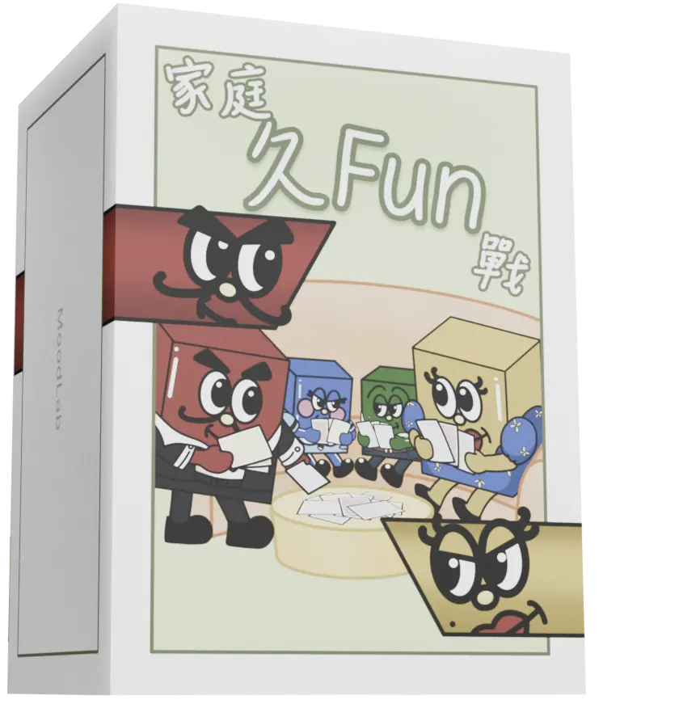 | 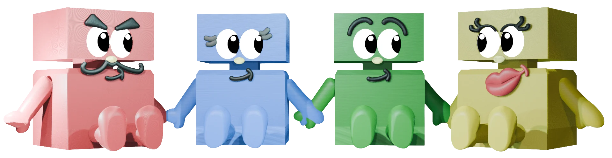 | 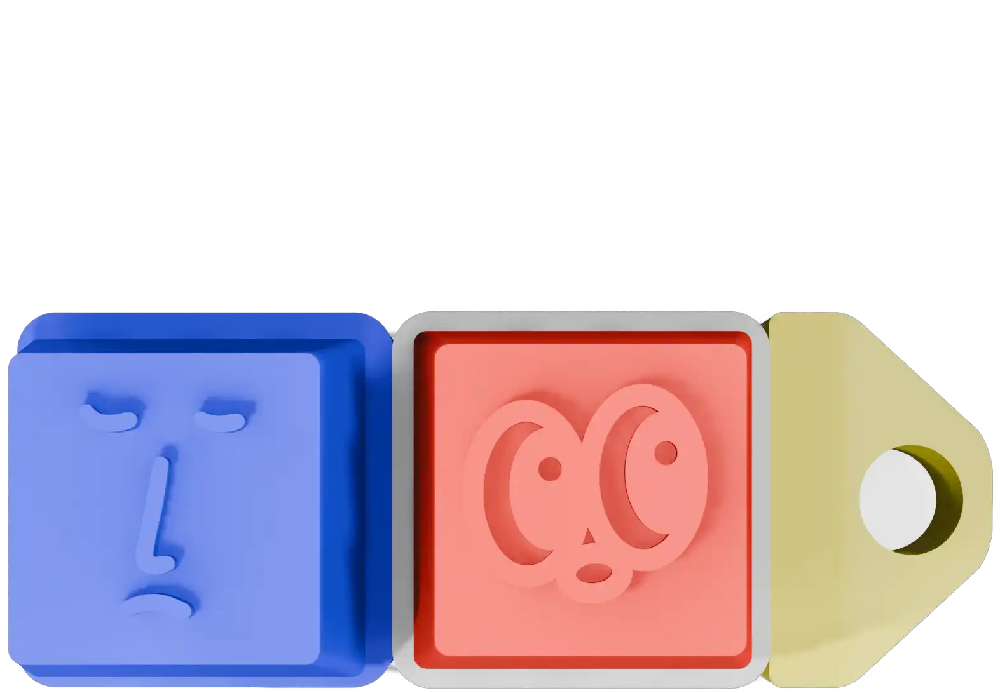 |
|            跨世代交流桌遊 · 96 張卡 身份／行動／懲罰／真心問題            |                  巨型互動機械鍵帽 自研 IC「BlaBla」聲效                   |                      磁吸情緒小鍵帽 五款地道表情・可換軸體                       |

**🎴 Family Fun Battle** — 跨世代交流桌遊，以和解卡與共融積分打破世代隔閡，讓彼此「原來你係咁睇」。
**🔘 BlaBla Keycap** — 以 The Chill Family 為主題，每次按壓發出「BlaBla」聲效，測謊減壓兩相宜，可承受最激烈的敲擊。
**🧲 Emotion Keycap** — 五款表情（又OT・唔係呀嘛・哇・正呀・先喊一波），磁吸互連或掛上鑰匙扣，給情緒一個出口。

---

## 👾 IP 角色 · Our Characters

The Chill Family 四個方塊角色 — 老豆・老母・女・子：

  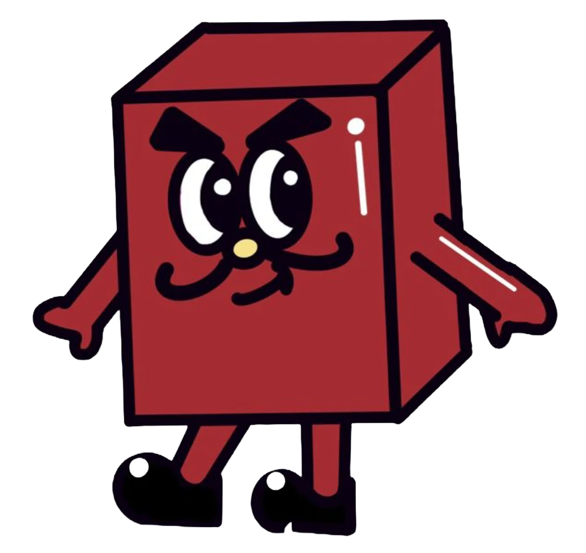
  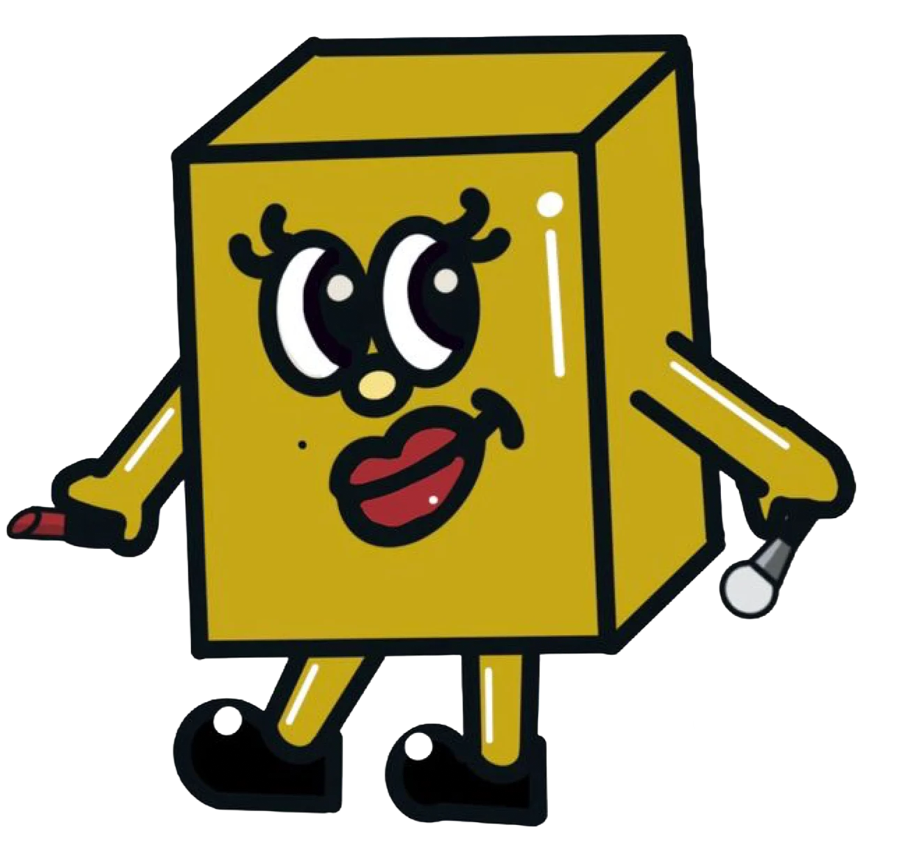
  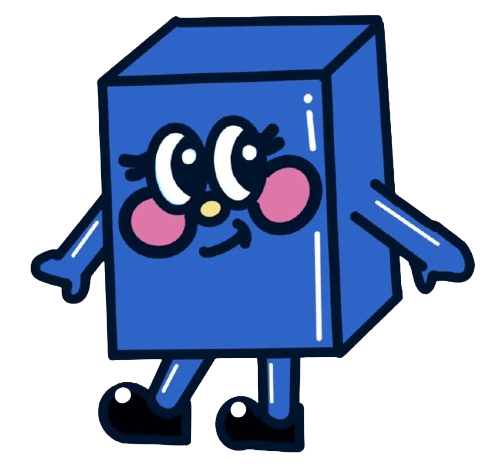
  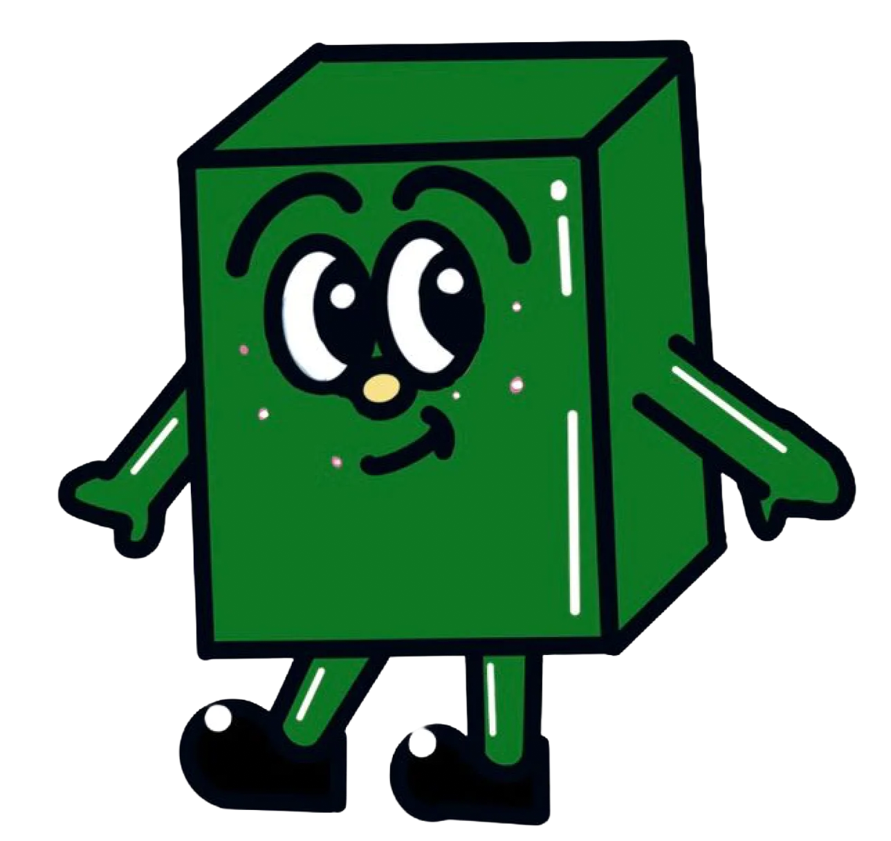

  <i>脆弱並不可恥，接納情緒才是療癒的開始。</i>

---

## 🛠️ 系統生態 · Our Systems

MoodLab 的數碼世界由 **7 個系統**組成，由同一核心工程一手打造：

  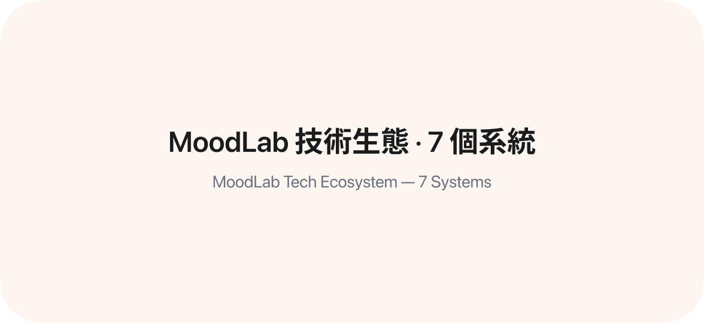

| 系統                  | 用途                             | 技術                                        | 主要語言          | 行數  |
| --------------------- | -------------------------------- | ------------------------------------------- | ----------------- | ----- |
| **Official Website**           | 官方網站（產品、訂單、AI、手冊） | Next.js 15 · React · Three.js · web-haptics | TypeScript        | 9,612 |
| **Customer Services** | 客戶服務：臨時代碼 + 訂單追蹤    | Firebase · HTML/JS                          | HTML · JavaScript | 3,466 |
| **MoodLab Sales**     | 銷售管理：記錄、查閱、認證       | Firebase Auth · Firestore                   | HTML · JavaScript | 3,362 |
| **Email API**         | 寄出 Email        | Firebase Admin · nodemailer · jsPDF         | JavaScript        | 474   |
| **MoodLab AI**        | AI 對話後端                      | Express · OpenAI / NIM API                  | JavaScript        | 212   |
| **Static Router**            | Firebase 路由轉發                | Firebase Hosting                            | HTML              | 6     |
| **Giant Keycap**      | BlaBla Keycap 電路         | HTML Canvas                                 | HTML              | 376   |

所有程式碼均由團隊**親手撰寫**——我們拒絕一味地、不經審核的 vibe-coding，追求安全、一致與完美。共計 **17,508 行**手寫應用程式碼：

  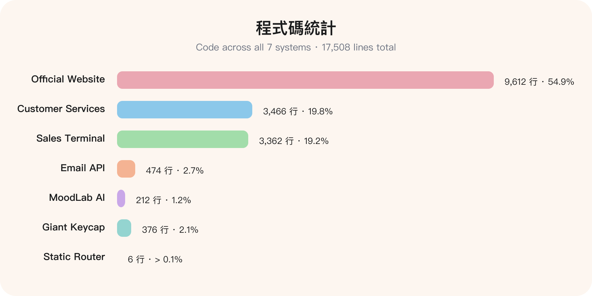

---

## 🧮 程式語言 · Programming Languages

全站程式碼的語言分佈（合計 **17,508 行**）：

  

| 語言           | 用途                                   | 行數  | 佔比  |
| -------------- | -------------------------------------- | ----- | ----- |
| **TypeScript** | 官方網站（Next.js App Router）與工具鏈 | 9,530 | 54.4% |
| **JavaScript** | 各系統前端邏輯與 Firebase 整合         | 3,519 | 20.1% |
| **HTML**       | 頁面結構與靜態介面                     | 3,408 | 19.5% |
| **CSS**        | 樣式與流動裝置體驗                     | 1,051 | 6.0%  |

> TypeScript 已將 `.ts` 與 `.tsx`（React 組件）合併計算；另有 Markdown 文檔 855 行、SVG 圖形 55 行；郵局及便利店資料 JSON 20,344 行屬數據而非程式碼，故未計入。

---

## 🔧 技術棧 · Tech Stack

- **Website** — Next.js on Vercel，附流動裝置觸覺回饋（haptic feedback）
- **Backend** — Google Firebase · NIM API（MoodLab AI）
- **Design / 3D** — Figma · Blender · Bambu Studio · PLA 3D printing
- **Internal systems** — Secure Terminal · Order Tracking · Express Checkout
- **AI policy** — 見 [`AI.md`](https://moodlab.vercel.app/software-technology/ai.md)

---

## 👥 團隊 · Team

  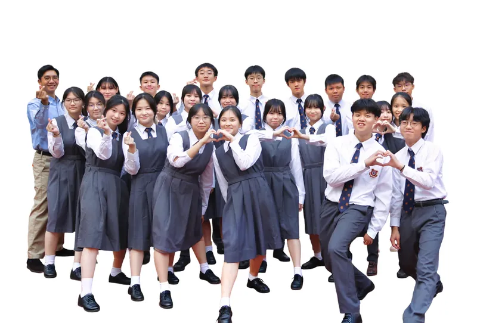

**23 名成員**，6 個部門各司其職，由指導老師與業界導師帶領：

  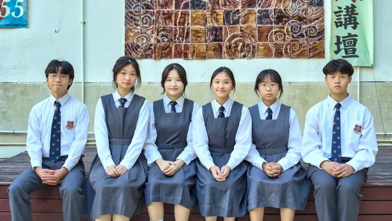
   
  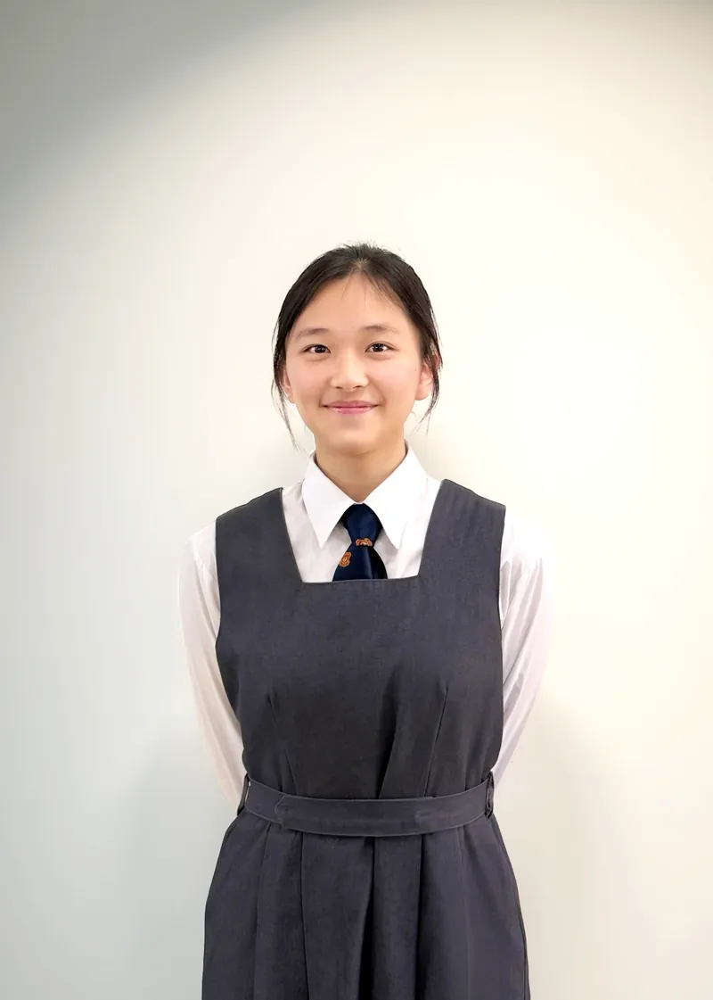

| 部門 Department       | 職責 Responsibility      |
| --------------------- | ------------------------ |
| **Operations**        | 物流、庫存與現場營運     |
| **Technology**        | 網站、系統與電子產品開發 |
| **Finance**           | 帳目、成本與財務報告     |
| **Sales & Marketing** | 銷售策略與推廣           |
| **Human Resources**   | 人事、培訓與內部協調     |
| **Design**            | 品牌、包裝與產品設計     |

### 👨‍💻 首席開發者 · Primary Developer

  

**[@ChuTM](https://github.com/ChuTM)** — 唯一網頁開發者，一手打造以上 **全部 7 個系統**。 
**[@ChuTM](https://github.com/ChuTM)** — the sole web developer behind **all 7 systems**.

---

## 🌱 環保承諾 · Sustainability

  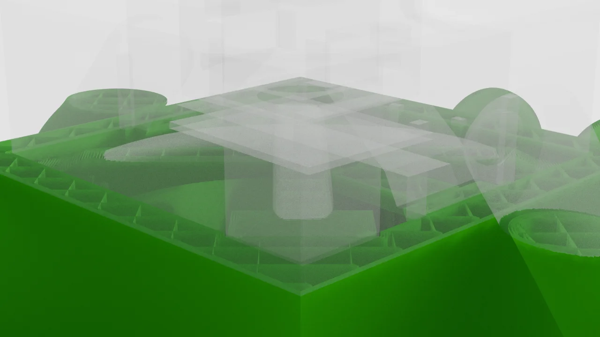

- **100% 可再生 PLA** 生物塑料（可工業堆肥，源於自然、歸於自然）
- **加法製造（3D 打印）** · 材料浪費減少 95% 以上
- 良心供應鏈 · 模組化物流 · **零紙張政策**

---

## 🔗 連結 · Links

- 🌐 **Website**: [moodlab.vercel.app](https://moodlab.vercel.app)
- 👨‍💻 **Developer**: [chutm.github.io](https://chutm.github.io/) · [@ChuTM](https://github.com/ChuTM)
- 📧 **Email**: [moodlab@scc.edu.hk](mailto:moodlab@scc.edu.hk)
- 📷 **Instagram**: [@moodlab_ja](https://www.instagram.com/moodlab_ja/)
- 🧾 **Annual Report 2025-26**: [PDF](https://moodlab.vercel.app/finalised_moodlab-annual-report_25-26.pdf)

---

_© Copyright 2025-2026 MoodLab. All rights reserved._
 
_The Chill Family and The Emotion Figures are intellectual property of MoodLab designers._

---

Generated by AI.
